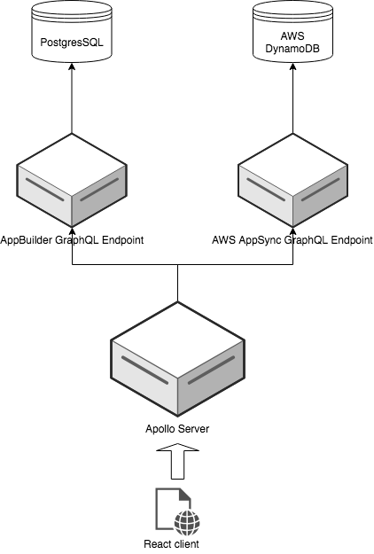

# Presentation Notes

## Schema Stitching Implementation
  - About 60 lines of code using node / Apollo Server. See implementation [here](server/index.js)
  - Does not need to know anything about endpoints. Introspection!

## AppSync
  - Still don't know anything about DynamoDB but have a functioning app that uses it
  - Start out with graphQL API and it builds the DB that will back it
    - Inversion of old concepts: rails let you define model and built the DB.
    - Inversion of Prisma - there you introspect DB to build API

